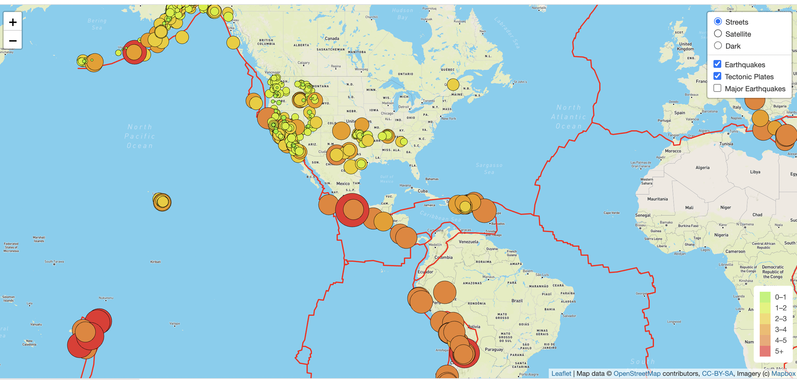

# Mapping Earthquakes

## Project Purpose 
The purpose of this project is to visually show the differences between the magnitudes of earthquakes all over the world for the last seven days.

## Project Tasks
To complete this project, I utilized a URL for GeoJSON earthquake data from the USGS website and retrieved geographical coordinates and the magnitudes of earthquakes for the last seven days. Then, using JavaScript and the Leaflet library, I plotted the data on a Mapbox map through an API request and created interactivity for the earthquake data.

## Map Functionality
1. The map includes 3 map styles, street, satellite, and dark, which can be selected from the overlay object.
2. The map includes data for all earthquakes in the last 7 days, tetonic plate locations, and data for earthquakes with a maginitude of 4.5+. This data can be removed or added to the map via the overlay object.
3. A legend represents the earthquake magnitude associated with each color marker on the map.
4. Each earthquake is represented by a color marker, and a popup for each earthquake includes its location information as well as the exact magnitude of the earthquake.

You can see the map functionality in this screenshot:
 
 
 ## Code Examples
 You can view the full Javascript code by opening the challenge_logic.js file in the Earthquake Challenge/static/css folder.
 Sample code snippets are included below.
 
 ### Creating a map layer by accessing the Mapbox API.
 
 ```
 // We create the tile layer that will be the background of our map.
let streets = L.tileLayer('https://api.mapbox.com/styles/v1/mapbox/streets-v11/tiles/{z}/{x}/{y}?access_token={accessToken}', {
	attribution: 'Map data &copy; <a href="https://www.openstreetmap.org/">OpenStreetMap</a> contributors, <a href="https://creativecommons.org/licenses/by-sa/2.0/">CC-BY-SA</a>, Imagery (c) <a href="https://www.mapbox.com/">Mapbox</a>',
	maxZoom: 18,
	accessToken: API_KEY
});

```

### Calling the raw json tectonic plate data using D3.js, styling the lines that will represent the tectonic plates, and adding this data to the map.

```
// Using d3.json() callback method, make a call to the tectonic plate data using the GeoJSON/PB2002_boundaries.json data from this GitHub repository
d3.json("https://raw.githubusercontent.com/fraxen/tectonicplates/master/GeoJSON/PB2002_boundaries.json").then(function(data) {

  // This function returns the style data for each of the earthquakes we plot on
  // the map. We pass the magnitude of the earthquake into two separate functions
  // to calculate the color and radius.
  let styleInfo = {
    color: "red",
    weight: 2
    }

  // Creating a GeoJSON layer with the retrieved data.
  L.geoJson(data, {
    style: styleInfo
  }).addTo(tectonicPlates);
});

  // Then we add the earthquake layer to our map.
  tectonicPlates.addTo(map);
  
  ```
